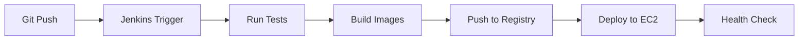

# RevTicket EC2 Deployment Guide

## 🚀 Complete CI/CD Pipeline: Git → Jenkins → Docker → EC2

### Prerequisites

1. **EC2 Instance** (t3.large or higher recommended)
2. **Jenkins Server** with Docker support
3. **Docker Hub Account**
4. **GitHub Repository**

### 1. EC2 Setup

#### Launch EC2 Instance
```bash
# Instance Type: t3.large (2 vCPU, 8GB RAM)
# OS: Ubuntu 22.04 LTS
# Storage: 30GB GP3
# Security Group: Allow ports 22, 80, 8080, 8500
```

#### Setup EC2 Instance
```bash
# SSH to your EC2 instance
ssh -i your-key.pem ubuntu@your-ec2-ip

# Run setup script
curl -fsSL https://raw.githubusercontent.com/your-repo/RevTicket_MicroServices/main/ec2-setup.sh | bash

# Or manually:
chmod +x ec2-setup.sh
./ec2-setup.sh
```

### 2. Jenkins Configuration

#### Install Jenkins Plugins
- Docker Pipeline
- SSH Agent
- GitHub Integration
- Pipeline: Stage View

#### Configure Credentials
1. **Docker Hub Credentials**
   - ID: `docker-hub-credentials`
   - Username: `harshwarbhe`
   - Password: `your-docker-token`

2. **EC2 SSH Key**
   - ID: `ec2-key`
   - Type: SSH Username with private key
   - Username: `ubuntu`
   - Private Key: Your EC2 key pair

3. **Environment Variables**
   ```
   EC2_HOST=your-ec2-public-ip
   EC2_USER=ubuntu
   ```

### 3. Pipeline Setup

#### Option A: Jenkins Pipeline (Recommended)
1. Create new Pipeline job
2. Use `Jenkinsfile.ec2` from repository
3. Configure webhook for automatic builds

#### Option B: GitHub Actions
1. Add secrets to GitHub repository:
   ```
   DOCKER_USERNAME=harshwarbhe
   DOCKER_PASSWORD=your-docker-token
   EC2_HOST=your-ec2-ip
   EC2_USER=ubuntu
   EC2_PRIVATE_KEY=your-private-key
   ```
2. Push to main branch triggers deployment

### 4. Manual Deployment

```bash
# Build and push images locally
docker build -t harshwarbhe/api-gateway:latest ./Microservices-Backend/api-gateway
docker push harshwarbhe/api-gateway:latest

# Deploy to EC2
./deploy-ec2.sh your-ec2-ip ubuntu ~/.ssh/your-key.pem
```

### 5. Environment Configuration

#### Create .env file on EC2
```bash
# On EC2 instance
cd /home/ubuntu
nano .env
```

```env
MYSQL_ROOT_PASSWORD=your-secure-password
JWT_SECRET=your-jwt-secret-256-bits-minimum
RAZORPAY_KEY_ID=your-razorpay-key
RAZORPAY_KEY_SECRET=your-razorpay-secret
MAIL_USERNAME=your-email@gmail.com
MAIL_PASSWORD=your-app-password
```

### 6. Deployment Flow



1. **Developer pushes code** to GitHub
2. **Jenkins webhook** triggers build
3. **Tests run** (Backend + Frontend)
4. **Docker images built** for all services
5. **Images pushed** to Docker Hub
6. **SSH to EC2** and deploy containers
7. **Health checks** verify deployment

### 7. Access Your Application

After successful deployment:

- **Frontend**: http://your-ec2-ip:80
- **API Gateway**: http://your-ec2-ip:8080
- **Consul Dashboard**: http://your-ec2-ip:8500
- **Health Check**: http://your-ec2-ip:8080/actuator/health

### 8. Monitoring & Logs

```bash
# SSH to EC2
ssh -i your-key.pem ubuntu@your-ec2-ip

# Check container status
docker-compose ps

# View logs
docker-compose logs -f api-gateway
docker-compose logs -f user-service

# Check resource usage
docker stats
```

### 9. Scaling & Updates

#### Rolling Updates
```bash
# Update specific service
docker-compose pull user-service
docker-compose up -d user-service

# Zero-downtime deployment
docker-compose up -d --no-deps user-service
```

#### Horizontal Scaling
```bash
# Scale specific service
docker-compose up -d --scale user-service=3
```

### 10. Troubleshooting

#### Common Issues

1. **Port conflicts**
   ```bash
   sudo netstat -tulpn | grep :8080
   sudo ufw status
   ```

2. **Memory issues**
   ```bash
   free -h
   docker system prune -f
   ```

3. **Database connection**
   ```bash
   docker-compose logs mysql
   docker exec -it revticket-mysql mysql -u root -p
   ```

4. **Service discovery**
   ```bash
   docker-compose logs consul
   curl http://localhost:8500/v1/agent/services
   ```

### 11. Security Considerations

- Use AWS Security Groups to restrict access
- Enable SSL/TLS with Let's Encrypt
- Rotate secrets regularly
- Monitor logs for suspicious activity
- Keep Docker images updated

### 12. Backup Strategy

```bash
# Database backup
docker exec revticket-mysql mysqldump -u root -p revticket_db > backup.sql

# MongoDB backup
docker exec revticket-mongodb mongodump --out /backup

# Volume backup
docker run --rm -v revticket_mysql_data:/data -v $(pwd):/backup alpine tar czf /backup/mysql-backup.tar.gz /data
```

### 13. Cost Optimization

- Use t3.medium for development
- Schedule stop/start for non-production
- Use spot instances for testing
- Monitor CloudWatch metrics
- Set up billing alerts

---

## Quick Commands Reference

```bash
# Deploy
./deploy-ec2.sh <EC2_IP> ubuntu ~/.ssh/key.pem

# Check status
ssh ubuntu@<EC2_IP> 'docker-compose ps'

# View logs
ssh ubuntu@<EC2_IP> 'docker-compose logs -f'

# Restart services
ssh ubuntu@<EC2_IP> 'docker-compose restart'

# Update images
ssh ubuntu@<EC2_IP> 'docker-compose pull && docker-compose up -d'
```